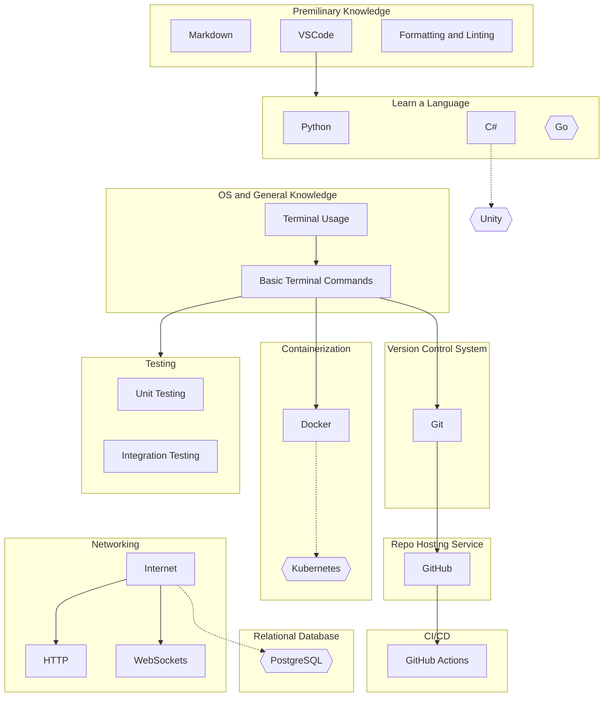

# Comp Dept.

Step by step guide for members of Comp Dept., THUASTA.

```mermaid
flowchart TB
  %% Hide lines for styling
  prog_lang --- os
  testing --- networking
  linkStyle 0,1 stroke:transparent;

  subgraph pre_knowledge[Premilinary Knowledge]
    markdown[Markdown]
    vscode[VSCode]
    format[Formatting and Linting]
  end

  subgraph prog_lang[Learn a Language]
    python[Python]
    csharp[C#]
    go{{Go}}
  end

  subgraph vcs[Version Control System]
    git[Git]
  end

  subgraph repo[Repo Hosting Service]
    github[GitHub]
  end

  subgraph os[OS and General Knowledge]
    terminal[Terminal Usage]
    commands[Basic Terminal Commands]

    terminal --> commands
  end

  subgraph testing[Testing]
    unit_testing[Unit Testing]
    integration_testing[Integration Testing]
  end

  subgraph ci_cd[CI/CD]
    github_actions[GitHub Actions]
  end

  subgraph container[Containerization]
    docker[Docker]
    k8s{{Kubernetes}}

    docker -.-> k8s
  end

  subgraph networking[Networking]
    internet[Internet]
    http[HTTP]
    websockets[WebSockets]

    internet --> http
    internet --> websockets
  end

  subgraph rel_db[Relational Database]
    postgres{{PostgreSQL}}
  end

  unity{{Unity}}

  vscode --> prog_lang
  commands --> git
  git --> github
  github --> github_actions
  commands --> docker
  commands --> testing

  internet -.-> postgres
  csharp -.-> unity
```
