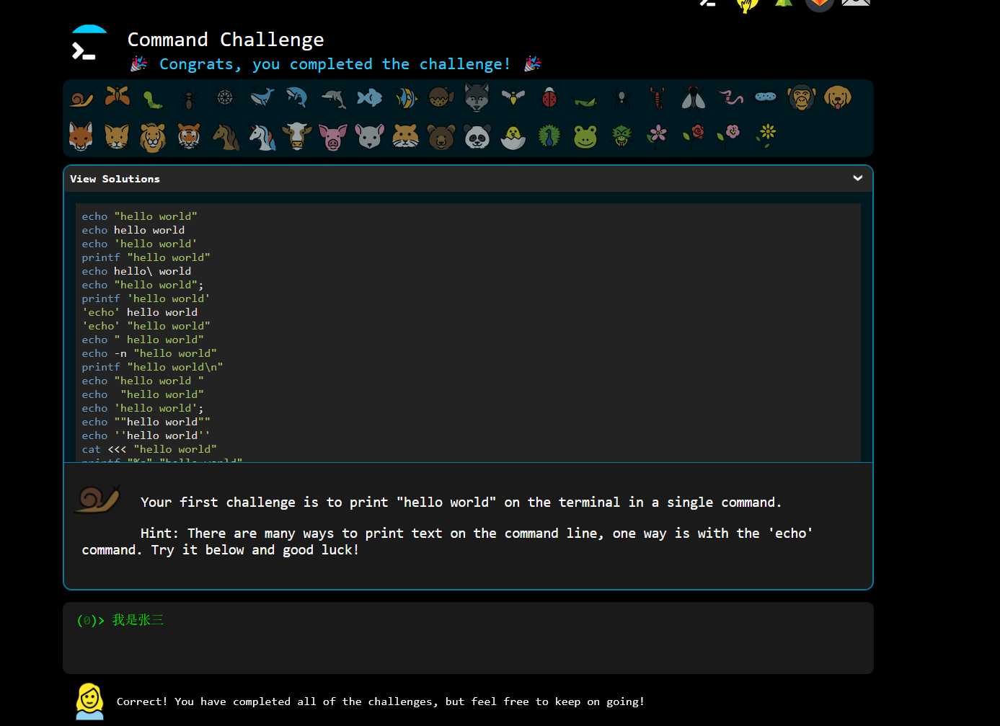

# Assignment 2: Dive into Command Line

## Goals

- Understand the basic concepts of Linux command line.

## Q1: Command Challenge

Complete the command challege at <https://cmdchallenge.com/>.

After you have completed the challenge, please type your name in the command line and take a screenshot of the page (like the following image) and submit it.

## Submitting Your Work

Once you have completed all the questions, please submit your work to Tsinghua Cloud, uploading them to the folder named after their name in Tsinghua Cloud (e.g. `ASTA2023/部门/竞赛部/技术培训/作业二/张三/screenshot.png`). If the folder does not exist, please create one.
