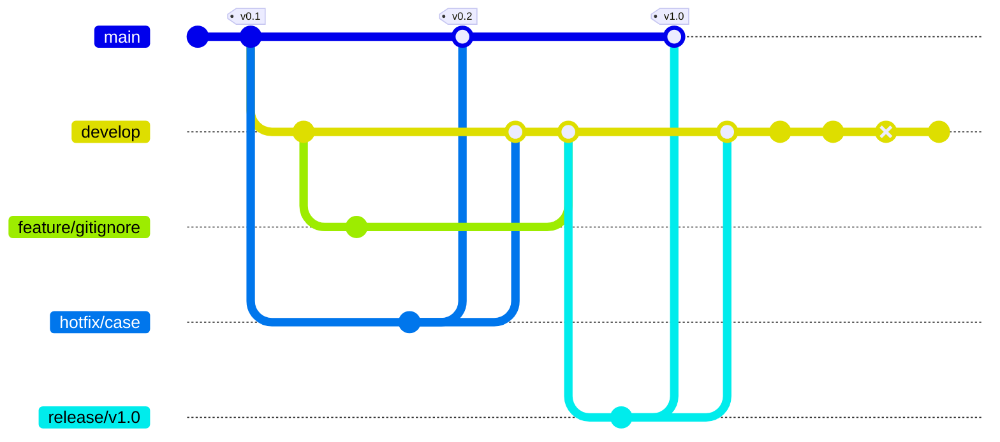

# Assignment 1: GitHub Flow

## Goals

The goal of this assignment is to give you practical experience with GitHub Flow, a lightweight, branch-based workflow that supports teams and projects where deployments are made regularly. You will create a simple project, make changes using Git, collaborate using GitHub, and automate deployment using GitHub Actions.

## Q1: Hello, Git and GitHub

Follow the instructions here:

**Configure Git**

Configure your name and email address. You may need to use a proxy.

**Fork a Repo**

Fork <https://github.com/THUASTA/git-practice-temp> to your own account.

**Clone the Repo**

Clone the forked repo to your local machine.

**Commit I**

Add a file called `hello.txt` to the repo with the following content. You should just copy and paste the content into the file.

```
Hello, Git!
Hello, Github!
Hello, GitHub Actions!

```

Commit the file to the repo. Every commit you make should follow [Conventional Commits](https://www.conventionalcommits.org/en/v1.0.0/). Then push the commit to GitHub.

**Tagging I**

Create a tag called `v0.1` for `main` branch you just made.

**Branching I**

Create a branch called `develop` from `main`. Then switch to the `develop` branch.

**Commit II**

Add a file called `hello2.txt` to the repo with the following content.

```
Hello2, Git!
Hello2, GitHub!
Hello2, GitHub Actions!

```

Modify `hello.txt` to the following content.

```
Hello1, Git!
Hello1, Github!
Hello1, GitHub Actions!

```

Commit the changes to the repo.

**Branching II**

Create a branch called `feature/gitignore` from `develop`. Then switch to the `feature/gitignore` branch.

**Commit III**

Add a file called `.gitignore` to the repo with the following content and 

```
*.tmp

```

Create some files with `.tmp` extension.

Commit the changes to the repo.

**Branching III**

Create a branch called `hotfix/case` from `main`. Then switch to the `hotfix/case` branch.

**Commit IV**

Modify `hello.txt` to the following content and commit the changes to the repo.

```
Hello, Git!
Hello, GitHub!
Hello, GitHub Actions!

```

**Merging I**

Merge `hotfix/case` into `main`. Then merge `hotfix/case` into `develop`. You may need to resolve conflicts. Every merge should disable fast-forward (`git merge --no-ff`).

**Tagging II**

Create a tag called `v0.2` for `main` branch you just made.

**Merging II**

Merge `feature/gitignore` into `develop`.

**Branching IV**

Create a branch called `release/v1.0` from `develop`. Then switch to the `release/v1.0` branch.

**Commit V**

Create a file called `LICENSE` with the following content and commit the changes to the repo.

```
MIT License

```

**Merging III**

Merge `release/v1.0` into `main`. Then merge `release/v1.0` into `develop`.

**Tagging III**

Create a tag called `v1.0` for `main` branch you just made.

Don't forget to push all the commits and tags to GitHub.

**Commit VI**

Checkout `develop` branch. Add `hello3.txt` to the repo with the following content and commit the changes to the repo.

```
Hello3, Git!
Hello3, GitHub!
Hello3, GitHub Actions!

```

**Commit VII**

Remove `hello2.txt` from the repo and commit the changes to the repo.

**Reverting I**

Revert the commit `Commit VI` and commit the changes to the repo.

**Commit VIII**

Add `name.txt` to the repo with your name and commit the changes to the repo.

**Push all branches and tags**

You can use `git push --set-upstream origin <branch>` to push a new branch to GitHub. You can use `git push --tags` to push all tags to GitHub.

**Check the Git Graph**

Now you have finished the first part of the assignment. Run `git log --all --decorate --oneline --graph
` and you may see something like this.

```
* a9db3ad (HEAD -> develop, origin/develop) Revert "chore: add hello3.txt"
* 41c8545 chore: remove hello2.txt
* 164f912 chore: add hello3.txt
*   affa463 Merge branch 'release/v1.0' into develop
|\
| | *   136a3f8 (origin/main, origin/HEAD, main) Merge branch 'release/v1.0'
| | |\
| | |/
| |/|
| * | 6981d7d (origin/release/v1.0, release/v1.0) chore: add license
|/ /
* |   6388700 Merge branch 'feature/gitignore' into develop
|\ \
| * | 3a6ed0a (origin/feature/gitignore, feature/gitignore) chore: add .gitignore file
* | |   4b3dbc8 Merge branch 'hotfix/case' into develop
|\ \ \
| |/ /
|/| |
* | | 920aa3a chore: add hello2.txt
| | * a621f2b (tag: v0.2) Merge branch 'hotfix/case'
| |/|
|/|/
| * 8a4de86 (origin/hotfix/case, hotfix/case) fix: fix case
|/
* 2b32704 (tag: v0.1) chore: add hello.txt
* 8ac995a chore: initial commit
```

The Git graph is shown below.



**Open a Pull Request**

Open a pull request from `main` of your forked repo to `main` of the upstream repo.

## Q2: Automation

**Write MkDocs Configurations**

Create a file called `mkdocs.yml` with the following content.

```yaml
site_name: My Git Graph

nav:
  - index.md
```

**Try MkDocs Locally**

Install MkDocs:

```bash
pip install mkdocs==1.5.2
```

Run the commands to write the git graph to `docs/index.md`:

```bash
echo -e "\`\`\`\n" >> docs/index.md
git log --all --decorate --oneline --graph >> docs/index.md
echo -e "\n\`\`\`" >> docs/index.md
```

Run MkDocs:

```bash
mkdocs build
```

Now you can see a `site` folder is created. Open `site/index.html` with your browser and you can see a simple page.

**Configure GitHub Actions**

Set up GitHub Actions workflow to generate the site and deploy to GitHub Pages automatically. Before deploying with Actions, you should adjust the settings of your repository. Go to `Settings` -> `Pages`.

## Submitting Your Work

You should finish your work by September 6th. Since you have already opened a pull request, it is no longer necessary to submit anything.
