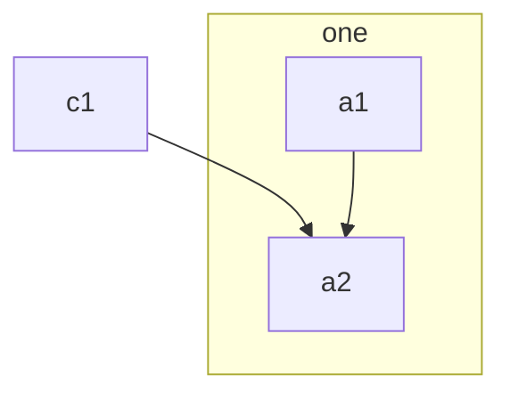

# Comp Dept.

Step by step guide for members of Comp Dept., THUASTA.

  - Comp Dept.:
    - Home: dept/comp.md
    - Premilinary Knowledge:
      - pre_knowledge/markdown.md
    - Learn a Language:
      - prog_lang/csharp.md
      - prog_lang/python.md
    - Version Control System:
      - vcs/git.md
      - vcs/github.md
    - OS and General Knowledge:
      - os/terminal.md
    - Testing:
      - test/unit_test.md
    - CI/CD:
      - cicd/github_actions.md
    - Containers:
      - virt/docker.md
    - Networking:
      - net/http.md
      - net/websocket.md

